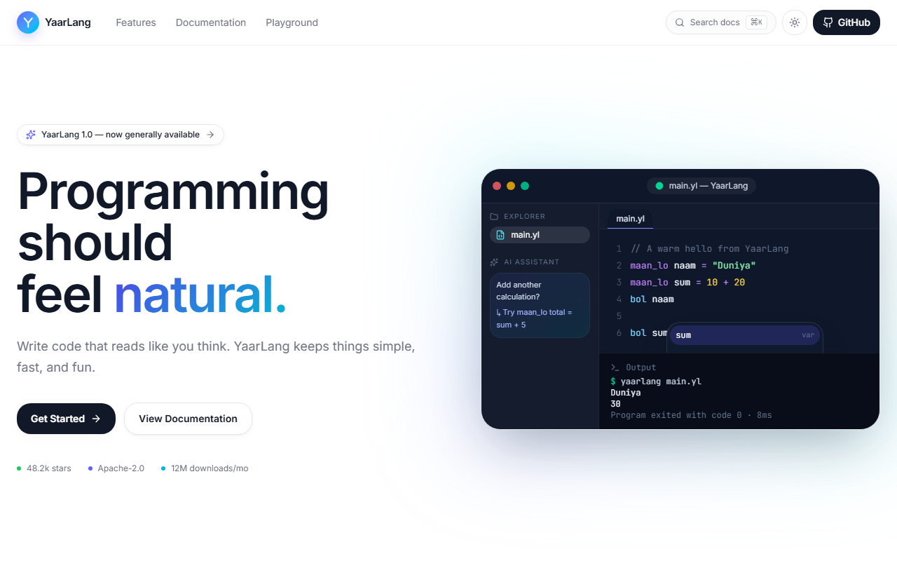

<div align="center">


# YaarLang

[](https://www.npmjs.com/package/yaarlang)
[](https://www.npmjs.com/package/yaarlang)
[](packages/YaarLang/LICENSE)
[](https://github.com/Munishwar001/yaarlang-the-future-of-code)

**A toy programming language with Hinglish keywords — write `maan_lo` instead of `let`, `agar` instead of `if`.**

</div>

<p align="center">
  
</p>

## Quick Example

```
maan_lo naam = "Duniya"
maan_lo sum = 10 + 20

bol naam
bol sum
```

```
$ yaarlang hello.yl
Duniya
30
```

## Why YaarLang?

Most "learn to build a language" projects stay a toy demo. YaarLang is the same idea taken a bit further: a real lexer → parser → codegen pipeline, wrapped in an actual published CLI/npm package, with an editor extension and a documentation site — all built from scratch in JavaScript, all Hinglish. It's not trying to be a production language; it's meant to be readable end-to-end, so the source itself is the best explanation of how a compiler works.

## Features

- **Hinglish syntax** — `maan_lo`, `bol`, `agar`/`nahito`, `jabtak`, `kaam`/`wapis`, `jodo`/`nikalo`/`lambai`, `sun`, `galti`
- **Variables & printing**, arithmetic/comparison/logical operators, `if`/`else`, `while` loops, functions with return values
- **Arrays** with literals, indexing, push/insert, pop/remove, and length
- **User input**, thrown errors, and single-line comments
- A **real compiler pipeline** (lexer → parser → AST → codegen → JS), not a pattern-matching trick
- A published **CLI / npm package**
- A **VS Code extension** for `.yl` syntax highlighting
- A **documentation site** with a searchable, multi-page language guide, every example verified against the real compiler
- An **in-browser playground** that runs a client-side port of the same lexer/parser/codegen

## Installation

```bash
npm install -g yaarlang
```

Or run it without installing:

```bash
npx yaarlang path/to/file.yl
```

Requires [Node.js](https://nodejs.org/) with ES module support.

## Quick Start

Create `hello.yl`:

```
maan_lo x = 10
maan_lo y = 20

maan_lo sum = x + y
bol sum
```

Run it:

```bash
yaarlang hello.yl
```

```
30
```

## Language Syntax

| Keyword | Meaning | Example |
|---|---|---|
| `maan_lo` | declare a variable | `maan_lo x = 10` |
| `bol` | print a value | `bol x` |
| `sun` | read user input | `maan_lo naam = sun("Naam? ")` |
| `agar` / `nahito` | if / else | `agar x > 5 { ... } nahito { ... }` |
| `jabtak` | while loop | `jabtak i <= 5 { ... }` |
| `kaam` / `wapis` | function / return | `kaam add(a, b) { wapis a + b }` |
| `jodo` | array push / insert | `jodo(nums, 5)` or `jodo(nums, 5, 0)` |
| `nikalo` | array pop / remove | `nikalo(nums)` or `nikalo(nums, 0)` |
| `lambai` | array length | `lambai(nums)` |
| `galti` | throw an error | `galti "Age cannot be negative"` |

**Operators:** `+ - * /` (unary `-` too), `== != < > <= >=`, `&& ||`, `=`. Comparisons and logical expressions produce booleans, which print as `sach` (true) / `jhoot` (false) — there's no literal boolean syntax, only these expressions produce one. `/` always returns a decimal (`7 / 2` → `3.5`).

**Comments:** `// single line only`, no block comments.

The full language guide — with syntax, examples, real verified output, and common mistakes for every feature — lives in the [Documentation](#documentation) site.

## Compiler Architecture

Nothing in YaarLang is interpreted directly. Every `.yl` file is compiled to plain JavaScript and executed by Node:

```
source.yl  →  lexer.js  →  parser.js  →  codegen.js  →  runtime.js
              tokens        AST          JS source      eval()
```

- **`lexer.js`** — turns raw source text into tokens (keywords, identifiers, numbers, strings, operators), tracking line/column for error messages.
- **`parser.js`** — recursive-descent parser that builds an AST, with standard precedence climbing for expressions (`||` → `&&` → comparison → `+ -` → `* /` → unary → primary/indexing).
- **`codegen.js`** — walks the AST and emits equivalent JavaScript.
- **`compiler.js`** — wires lexer → parser → codegen into one pipeline.
- **`runtime.js`** — executes the generated JavaScript.
- **`index.js`** — the CLI entry point: reads a file, runs the pipeline, prints errors in red.

## Project Structure

```
yaarlang-the-future-of-code/
├── packages/
│   ├── YaarLang/            # the language: lexer, parser, codegen, CLI (published as "yaarlang" on npm)
│   │   ├── lexer.js
│   │   ├── parser.js
│   │   ├── codegen.js
│   │   ├── compiler.js
│   │   ├── runtime.js
│   │   ├── index.js          # CLI entry point
│   │   └── examples/
│   └── vscode-yaarlang/      # VS Code extension: syntax highlighting for .yl files
└── src/                       # the website: marketing site + docs (TanStack Start)
    ├── routes/
    │   ├── index.tsx          # marketing page
    │   └── docs/              # multi-page documentation
    ├── components/yaarlang/
    └── lib/yaarlang.ts        # browser port of the compiler, powers the in-browser Playground
```

## CLI

```bash
yaarlang <file.yl>
```

Reads the file, compiles it through the lexer → parser → codegen pipeline, and runs the result. Compile errors are printed with the line and column where they occurred:

```
YaarLang error: Expected '{' to start block (line 3, column 8)
```

## VS Code Extension

`packages/vscode-yaarlang` adds syntax highlighting for `.yl` files via a TextMate grammar — no language server or diagnostics yet, just colors. Install it from the packaged `.vsix`:

```bash
code --install-extension packages/vscode-yaarlang/vscode-yaarlang-0.0.1.vsix
```

## Playground

The website includes an in-browser playground that runs a client-side port of the real lexer/parser/codegen, so code you paste in actually compiles and executes in the browser — no server round-trip. Run the site locally (see below) and open the Playground section on the homepage.

```bash
cd yaarlang-the-future-of-code
npm install
npm run dev
```

## Documentation

The full language guide is a multi-page docs site under `/docs`, covering Overview, Installation, CLI Usage, Variables & Printing, Operators, Booleans, Conditions, Loops, Functions, Arrays, Input, Errors, and Comments. Every page follows the same structure — **What it is → Syntax → Example → Output → Notes & Rules → Common Mistakes** — and every example's output was verified against the real compiler, not guessed. It also has a keyword-aware search (⌘K / Ctrl+K).

## Examples

`packages/YaarLang/examples/test.yl` exercises most of the language in one file:

```
maan_lo age = 20

agar age >= 18 {
  bol 'Bada ho gaya'
} nahito {
  bol 'Abhi chhota hai'
}

maan_lo i = 1
jabtak i <= 5 {
  bol i
  i = i + 1
}

kaam add(a, b) {
  wapis a + b
}
bol add(3, 4)

maan_lo nums = [10, 20, 30]
bol nums[0]
nums[1] = 99
bol nums

bol "lanbai  " + lambai(nums)

maan_lo temparr = []
jodo(temparr, 1)
jodo(temparr, 2)
jodo(temparr, 3)
jodo(temparr, 4, 1)
bol temparr

nikalo(temparr)
bol temparr

nikalo(temparr, 0)
bol temparr

galti 'Age cannot be negative'
```

Running it produces:

```
Bada ho gaya
1
2
3
4
5
7
10
[ 10, 99, 30 ]
lanbai  3
[ 1, 4, 2, 3 ]
[ 1, 4, 2 ]
[ 4, 2 ]
YaarLang error: Age cannot be negative
```

(It ends there on purpose — that last line demonstrates `galti` halting the program.)

## Roadmap

Not implemented yet, and not hidden about it:

- [ ] `for` loops
- [ ] `break` / `continue`
- [ ] `try` / `catch` (error handling beyond `galti` halting the program)
- [ ] Classes
- [ ] Async / await
- [ ] A package manager
- [ ] Language server for the VS Code extension (diagnostics, not just highlighting)

## Contributing

Issues and pull requests are welcome at [github.com/Munishwar001/yaarlang-the-future-of-code](https://github.com/Munishwar001/yaarlang-the-future-of-code).

## License

MIT — see [packages/YaarLang/LICENSE](packages/YaarLang/LICENSE).
